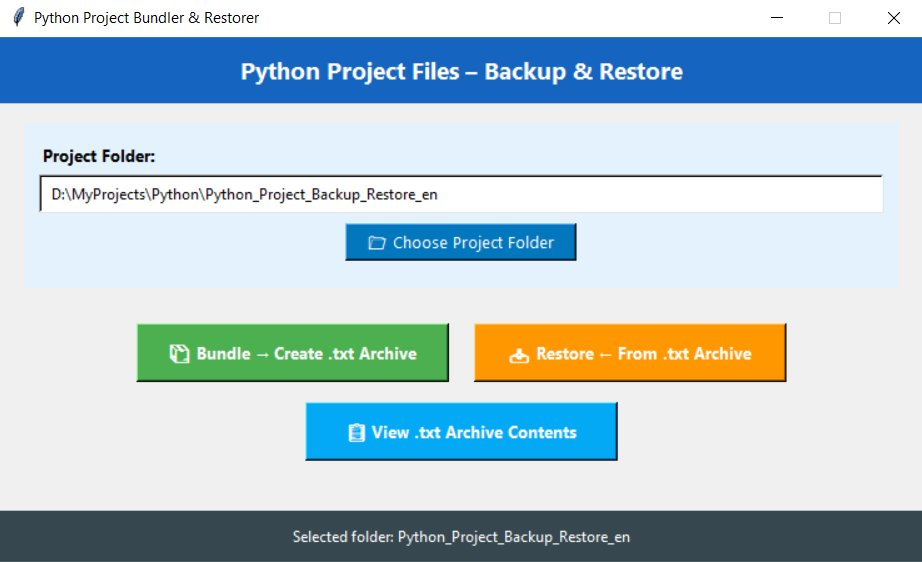
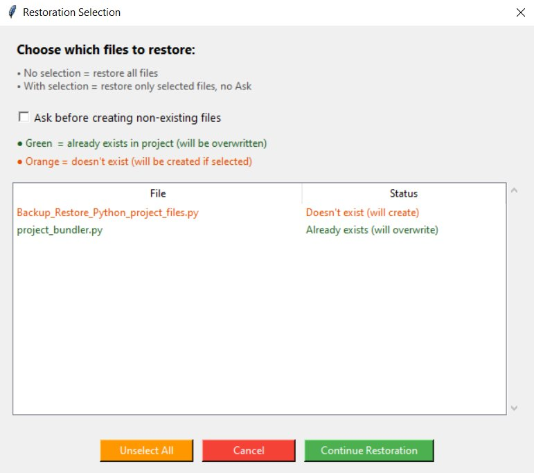

# Python Project Bundler & Restorer

[](https://www.python.org/downloads/)
[](../LICENSE)
[](https://github.com/yourusername/python-project-bundler)

Простой инструмент с графическим интерфейсом для резервного копирования и восстановления Python-проектов путём объединения всех `.py` файлов в один текстовый архив.

**🌍 Языки:** [English](../README.md) | [Русский](#) | [Latviešu](README_LV.md)

---

## 📋 Содержание

- [Возможности](#-возможности)
- [Скриншоты](#-скриншоты)
- [Установка](#-установка)
- [Использование](#-использование)
- [Как это работает](#-как-это-работает)
- [Требования](#-требования)
- [Участие в разработке](#-участие-в-разработке)
- [Лицензия](#-лицензия)

---

## ✨ Возможности

- **📦 Архивация проектов**: Объединение всех Python файлов в папке в один `.txt` архив
- **📥 Восстановление проектов**: Извлечение и восстановление файлов из архива в папку проекта
- **🎯 Выборочное восстановление**: Выбор файлов для восстановления через визуальный интерфейс
- **🔍 Предпросмотр архива**: Просмотр содержимого архива без восстановления
- **🎨 Удобный интерфейс**: Чистый, современный интерфейс на Tkinter
- **🛡️ Безопасные операции**: Цветные предупреждения для существующих файлов
- **⚙️ Гибкость**: Выбор как папки проекта, так и места сохранения архива

---

## 📸 Скриншоты

### Главное окно

*Главный интерфейс с тремя основными действиями*

### Диалог выбора файлов

*Выберите файлы для восстановления с цветовой кодировкой статуса*

---

## 🚀 Установка

### Предварительные требования

- Python 3.7 или выше
- tkinter (обычно входит в состав Python)

### Быстрый старт

1. **Клонируйте репозиторий:**
   ```bash
   git clone https://github.com/Patisons/python-project-bundler.git
   cd python-project-bundler
   ```

2. **Запустите приложение:**
   ```bash
   python project_bundler.py
   ```

Вот и всё! Внешние зависимости не требуются.

---

## 📖 Использование

### 1. Архивация файлов (Создание архива)

1. Нажмите **"Choose Project Folder"** и выберите папку вашего Python проекта
2. Нажмите **"📦 Bundle → Create .txt Archive"**
3. Выберите, куда сохранить архив (по умолчанию: папка проекта с временной меткой)
4. Готово! Все `.py` файлы теперь объединены в один текстовый файл

### 2. Восстановление файлов (Из архива)

1. Нажмите **"Choose Project Folder"**, чтобы выбрать целевую папку
2. Нажмите **"📥 Restore ← From .txt Archive"**
3. Выберите файл архива для восстановления
4. В диалоге выбора:
   - **Зелёные** файлы = уже существуют (будут перезаписаны)
   - **Оранжевые** файлы = не существуют (будут созданы)
5. Выберите файлы для восстановления (или не выбирайте ничего, чтобы восстановить все существующие файлы)
6. При желании отметьте "Ask before creating non-existing files"
7. Нажмите **"Continue Restoration"**

### 3. Просмотр содержимого архива

1. Нажмите **"📋 View .txt Archive Contents"**
2. Выберите файл архива
3. Просмотрите все файлы, хранящиеся в архиве, без их восстановления

---

## 🔧 Как это работает

### Формат архива

Инструмент создаёт читаемые текстовые архивы такой структуры:

```
# Project Archive – МойПроект
# Date: 2026-02-15 12:30:45
# Total files: 3

=== main.py ===
import tkinter as tk
...
=== END ===

=== utils.py ===
def helper():
    ...
=== END ===

=== config.py ===
settings = {}
...
=== END ===
```

### Ключевые компоненты

- **ProjectManager**: Управляет файловыми операциями в папке проекта
- **ArchiveManager**: Создаёт и парсит текстовые архивы
- **FileSelectionDialog**: Интерактивный выбор файлов для восстановления
- **ProjectBundlerApp**: Основное GUI приложение

---

## 📦 Требования

- **Python**: 3.7+
- **Только встроенные модули**:
  - `tkinter` - фреймворк GUI
  - `pathlib` - операции с путями файлов
  - `datetime` - временные метки
  - `re` - парсинг архива

---

## 🤝 Участие в разработке

Приветствуются любые вклады! Вот как вы можете помочь:

1. Сделайте форк репозитория
2. Создайте ветку функции (`git checkout -b feature/УдивительнаяФункция`)
3. Зафиксируйте изменения (`git commit -m 'Добавить УдивительнуюФункцию'`)
4. Отправьте в ветку (`git push origin feature/УдивительнаяФункция`)
5. Откройте Pull Request

### Направления для улучшения

- Добавить поддержку других типов файлов (`.txt`, `.md`, `.json` и т.д.)
- Реализовать сжатие для больших проектов
- Добавить шаблоны проектов
- Создать CLI версию
- Добавить опцию шифрования архива

---

## 📄 Лицензия

**Do What You Want License** - Используйте как хотите. Без ограничений. Без условий. Просто не вините меня, если что-то сломается! 😄

См. файл [LICENSE](../LICENSE) для полного "юридического бла-бла-бла" (спойлер: он очень короткий и человекочитаемый).

**Хотите сказать спасибо?** Проверьте файл LICENSE для необязательных способов поддержать проект.

---

## 👨‍💼 Автор

Создано с ❤️ **Pats-MK** и **Claude**

---

## 🙏 Благодарности

- Построено с использованием только стандартной библиотеки Python
- Вдохновлено потребностью в простых, портативных резервных копиях проектов
- Спасибо сообществу Python за отличную документацию

---

## 📞 Поддержка

Если вы столкнулись с проблемами или у вас есть вопросы:

1. Проверьте страницу [Issues](https://github.com/Patisons/python-project-bundler/issues)
2. Создайте новую проблему, указав:
   - Вашу версию Python
   - Операционную систему
   - Шаги для воспроизведения проблемы
   - Сообщения об ошибках (если есть)

---

**⭐ Если вы находите этот инструмент полезным, пожалуйста, поставьте звезду!**
